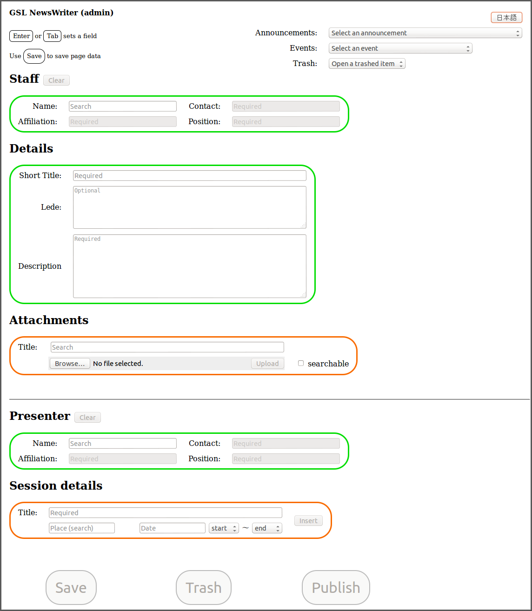

# NewsWriter

## Overview

NewsWriter is a tool for maintaining front-page news and
announcements. This might seem a trivial task: we have a standard for
exchanging calendar data (RFC 5546), and another for publishing news
(RFC 4287), and plenty of kit that does a good job of reading and
presenting both (from Android tablets to the iPad, from Google
Calendar to the venerable MS Outlook, and on to the swelling gaggle of
smartphone brands and versions). Consuming news and schedules is now
simple enough at the user end, but production is, unfortunately,
another matter -- and it should not be.

In a university context, in particular, news feeds and
machine-readable calendar objects are natural partners. Properly
applied, they can bring activity in eclectic, separately managed
projects into clear focus across the local community. There are surely
corporate publishing platforms around that effectively integrate the
two, but where territorial incentives dominate, and the start-line is
a passel of static project websites composed with DreamWeaver and the
like, that may not be an option.  That is the case at my place of
work, so I scratched the itch by writing this tool. I hope you find
it useful.

NewsWriter simplifies the deployment of integrated news and calendar
information at both ends. Input is controlled through a simple
one-page view into an SQLite database, with search-as-you-type input
of reusable content, and widgets for quick entry of date
details. Content is published as an integrated set of page, feed and
calendar objects through a flexible template mechanism, and can be
placed on the target website via rsync. The result can be viewed on
the site of the [Nagoya University Graduate School of
Law](http://law.nagoya-u.ac.jp/en), for which NewsWriter was
originally built.

## Demo Installation

Playing with a demo installation is the best and quickest way to
explore the operation of the tool. NewsWriter is a `node.js`
application that relies no `rsync`, so those two utilities must be
installed on your system. With that in place, install the NewsWriter
package:

    npm install newswriter

NewsWriter contains a (very) small webserver that can be used for
a quick demo. Run it by opening a terminal and running the following
command (or creating a `node.js` script with the same content):

    > require('newswriter').runDemoServer();
    Listening on http://localhost:8082

You can view the demo website at its URL:

    http://localhost:8082/

The website is initially empty, and will return a `404` page. To give
it some content, open a second terminal and create a file with the
following line to use as a run script (the script will require an
argument, so it cannot be executed easily from within `node.js`, hence
the need for a script file):

    require('newswriter').run();

The demo server provides a runtime NewsWriter configuration for the
demo, tied to the port on which NewsWriter itself will run.  If the
line above is saved in a file `writer.js`, you can bring up NewsWriter
with the following command:

    $ node writer.js -p 8081

Visit NewsWriter by pointing your browser at its URL:

    Reading config from newswriter-8081.cfg

    Admin URL: http://localhost:8081/?admin=ol1p9jn3&id=1&key=ol1p9jn3

    Editor URL for admin: http://localhost:8081/?admin=ol1p9jn3&id=1&key=ol1p9jn3
    Reviewer URL for reviewer: http://localhost:8081/?page=pending&id=2&key=f8njwbcg
    Done. Ready to shake, rattle and roll!

You can now access NewsWriter by pointing your browser at its admin
URL. Note that the key values for your installation will differ: use
the URL reported to the terminal at startup. In this case, that was:

    http://localhost:8081/?admin=ol1p9jn3&id=1&key=ol1p9jn3

The form will look like that shown at the bottom of this page.  There
is a logic to the form navigation that should become apparent with a
little experimentation. As the note at the top of the form says, you
need to use `Enter` or `Tab` to save a field: if you click outside of
the field during editing, the original content will be restored. If
you lose content accidentally, it can be recovered (on Firefox under
Linux, at least) with `Ctrl-Z`.

Items save with only Convenor details, a Title, and Description (plus
perhaps an Attachment) are saved as Announcements. Items that also
have both Presenter details and one or more Sessions are saved as
Events.

When the Publish key is pressed, the most recent ten Announcements
and the most recent ten Events are published to the page. You can view
the published output by visiting the target website again:

    http://localhost:8081/

Explore the pages, calendars and news feeds by clicking
around. Everything should just work.

In some environments, it may be desired to allow items to be reviewed
before final publication. For this purpose, items that have been
saved, but not published, become visible in a special feed keyed to
the `reviewer` role. You can access it with the URL reported by
NewsWriter at startup. In our case this was:

    http://localhost:8081/?page=pending&id=2&key=f8njwbcg

The reviewer feed links back to a Reviewer view of the NewsWriter
page.  Reviewer views have permission only to edit content and mark it
as approved: a reviewer cannot publish content directly.

For production, you will want to run NewsWriter on a port that is
accessible only from the server itself, and channel external calls
to it via a rewrite recipe that is protected by login, and masks
the `admin` key from view. If you would like the `lighttpd` recipe
that we use for that purpose in our environment, feel free to write
to me on `bennett@nagoya-u.jp`.

To adapt NewsWriter to an existing website, you will want to break the
existing top page into its constituent parts and create templates.  To
get that going, make a copy of the demo style files to use as a
starting point:

    $ cp style/demo.js style/production.js
    $ cp -r style/demo style/production

To create the production profiel, run NewsWriter against a different
port to create a fresh database and profile for production use:

    $ node writer.js -S production -p 6338

NewsWriter will complain about numerous missing parameters: to set
things up, work through the warnings and supply the necessary details.
The demo configuration at `newswriter-8081.cfg` may be useful as
a reference.

The way templates work will probably be obvious if you have JavaScript
experience. The callbacks correspond to placeholders in the relevant
template, and have access to the content for the target block via the
`data` argument. Callbacks have access to a catalogue of utility
functions and configuration variables under the `this.sys` object.
`this` also provides access to some of the template functions
themselves, which are used for some dirty tricks that are best taken
at face value, or studied by looking at the source.

If you try NewsWriter and like it, let me know with a shout-out on
Twitter (I'm `@fgbjr` over there). If anyone is motivated to document
the signatures of the functions available to the template engine,
I'll be glad to add that to this `README` with attribution; but for
the present I'll be happy if NewsWriter serves the purpose for you:
the world certainly needs more news, and less email.

Enjoy!

Frank Bennett, Nagoya University, Japan

# NewsWriter page view

